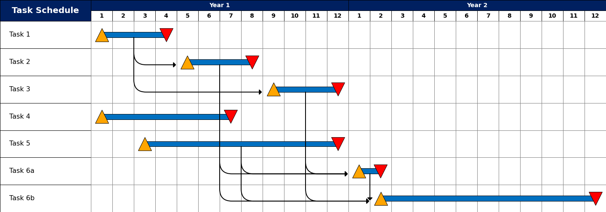

# Python Gantt Project Timeline

Jupyter notebook to generate project timelines

# Dependencies
- Matplotlib
- Numpy

# Limitations
- Built for projects lasting 6 months to a few years in length. Needs to be generalized to work on smaller timelines
- Does not support critical path
